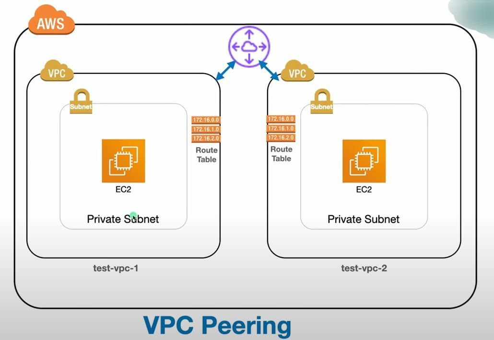

# AWS VPC Peering Project

## Project Overview

This project demonstrates the implementation of VPC Peering between two Amazon VPCs.

The project includes:

- VPC Creation
- Subnet Configuration
- Route Table Configuration
- VPC Peering
- EC2 Deployment
- IAM Role Configuration
- CloudWatch Monitoring
- VPC Flow Logs

The implementation was performed using AWS Free Tier services.

---

## Architecture Diagram

---

## AWS Services Used

- Amazon VPC
- Amazon EC2
- IAM Roles
- Route Tables
- Internet Gateway
- VPC Peering
- CloudWatch
- VPC Flow Logs

---

## Implementation Steps

1. Created VPC-A
2. Created VPC-B
3. Created Subnets
4. Configured Route Tables
5. Created VPC Peering Connection
6. Launched EC2 Instances
7. Configured Security Groups
8. Attached IAM Roles
9. Enabled CloudWatch Monitoring
10. Configured VPC Flow Logs

---

## Project Demo

YouTube Video:

https://youtu.be/Z-aX430K7ws?si=veMo_jF7xL2jFOzK

---

## Learning Outcomes

- AWS Networking
- VPC Peering
- EC2 Deployment
- IAM Roles
- CloudWatch Monitoring
- VPC Flow Logs
- Network Security

---

## Author

Kanaparthi Sai Dheeraj
